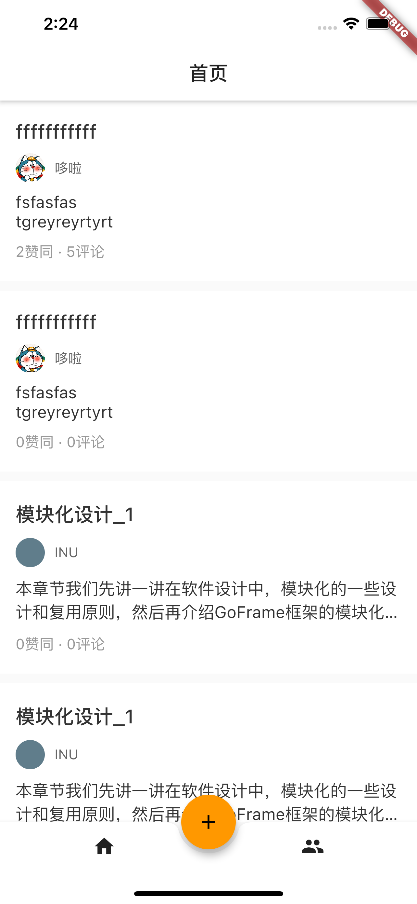
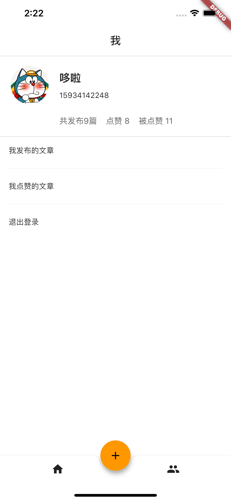
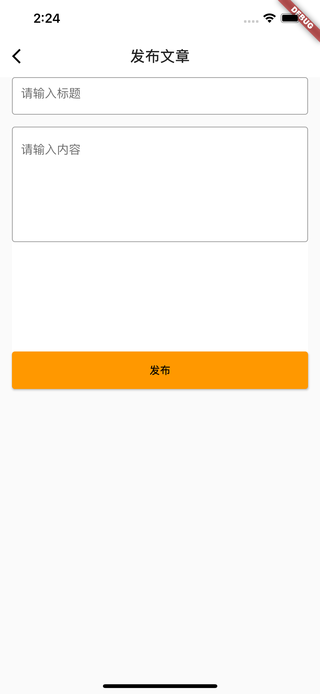
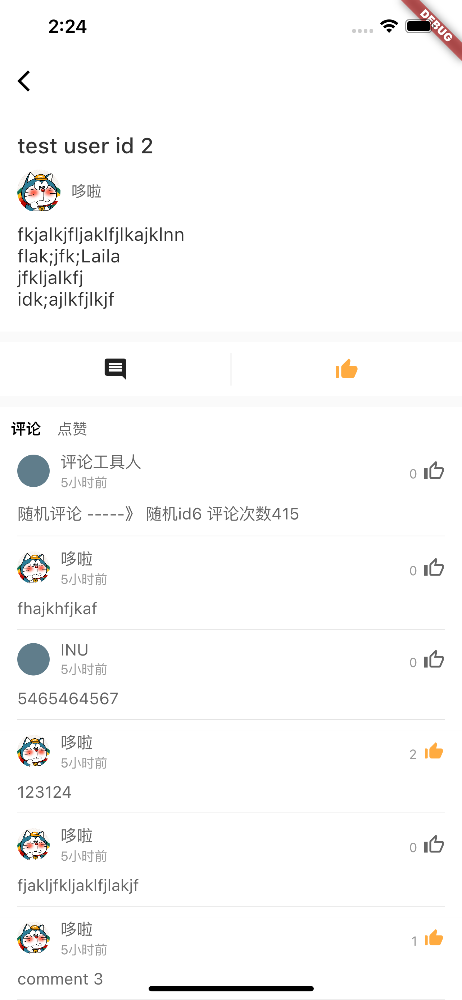
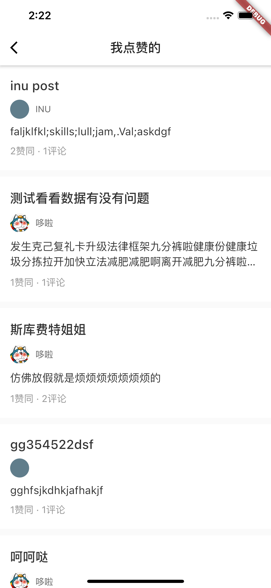
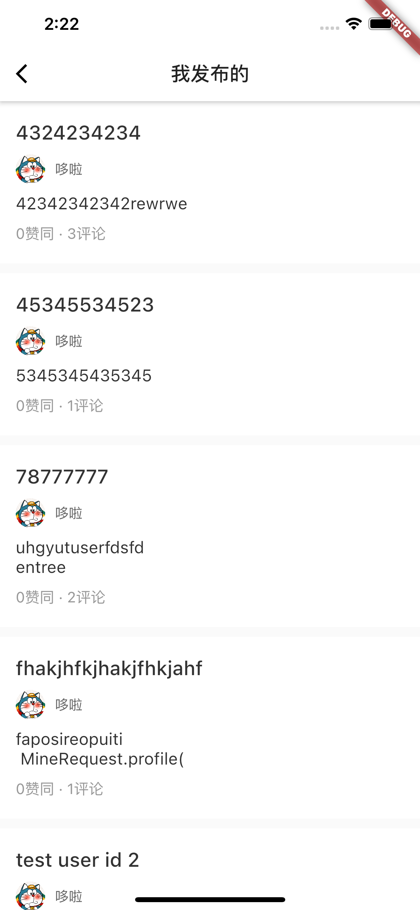
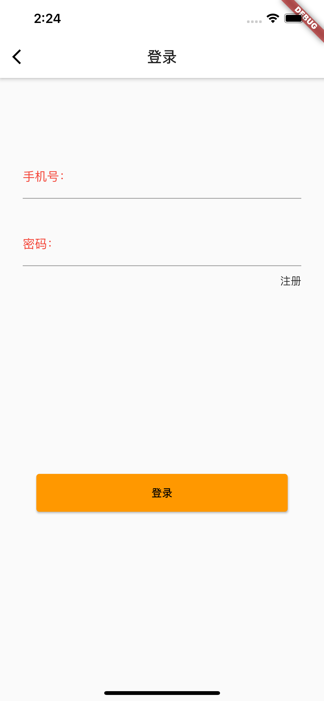
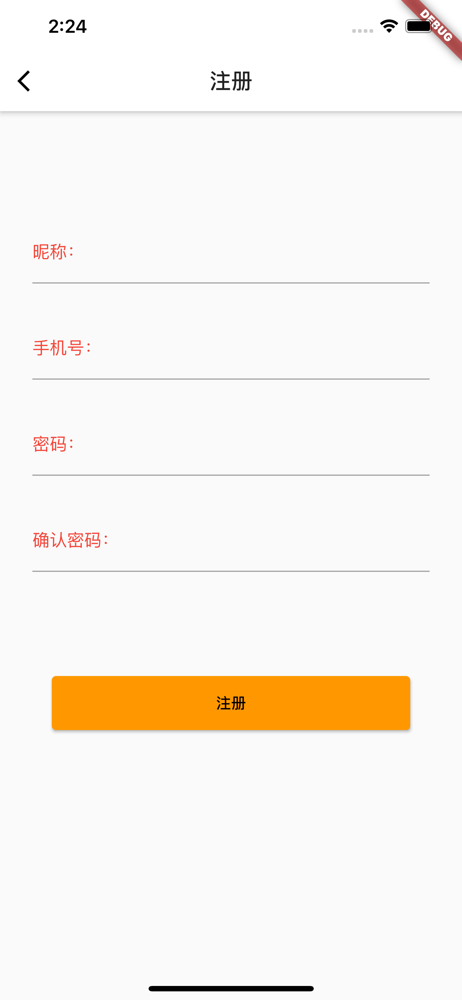

# 使用 GF + FLUTTER 快速搭建一个简易的前后端项目

作为一个后端小白，最近打算学习一些后端方面知识，仅仅作为个人技术拓展，暂时不打算向后端转型。
考虑到 JAVA 过于厚重且框架繁多而选择 GO 这种相对简洁简单而且轻量的语言来尝试做几个简单小项目来学习。

首先选择的技术框架为 GF: GOFRAME
选择 GF 的原因有几个：

1. 它是高度模块化框架，工程完备、简单易用，模块化、高质量、高性能、企业级开发框架。你需要的任何工具它都可以完美支持。
2. 文档完善，GF 的作者是由国内开发者郭强开发，这样免去了去外网查找资料的困扰。作者本人也很活跃，有什么问题基本都可以解决。
3. 我身边几个 GO 开发者都是使用这个框架，我可以先简单通过他们的项目照猫画虎的很快做好。

当然也会有一些问题，比如由于它的高度封装，你的调用链可能是第二层，第三层或者更多，在初级阶段建议还是更多的了解一些源码才能更好的帮助到自己。
另外虽然用 `gf gen dao` 可以很好的帮助我们规范 dao mao server 层，但也是仅仅针对小型项目业务比较简单这样用没什么问题，对于一些业务稍微复杂的大型项目那就完全这种用法。不过，对于初学者来说，已经很完美了。

### 项目功能介绍

该项目功能为一个基础的社交平台框架，用户可以发布文章，评论点赞这些基础功能。

本项目包含：
- [x] swagger 文档
- [x] 用户注册
- [x] 用户登录
- [x] 用户基本信息
- [x] 退出登录
- [x] jwt 用户鉴权
- [x] 文章列表
- [x] 发布文章
- [x] 文章详情
- [x] 发布评论
- [x] 点赞/取消点赞
- [x] 我点赞的文章
- [x] 我发布的文章

### Previews

 

